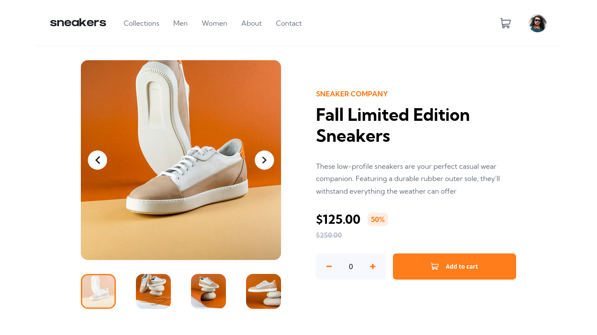
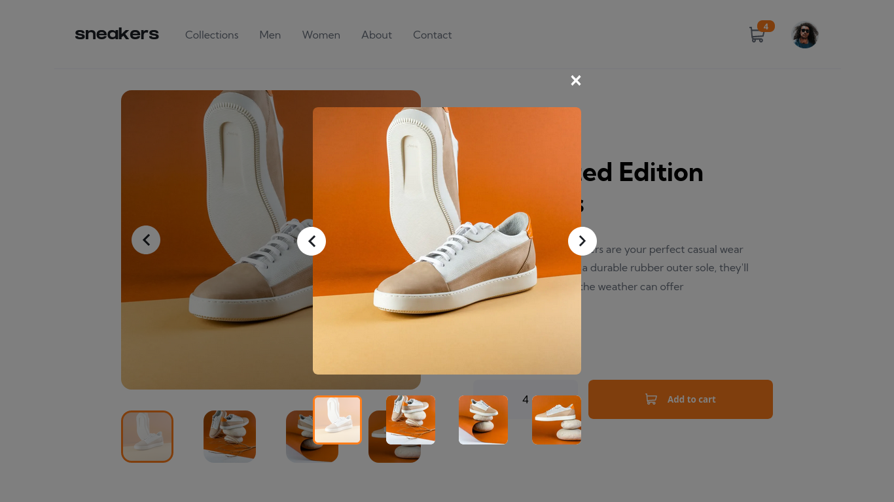
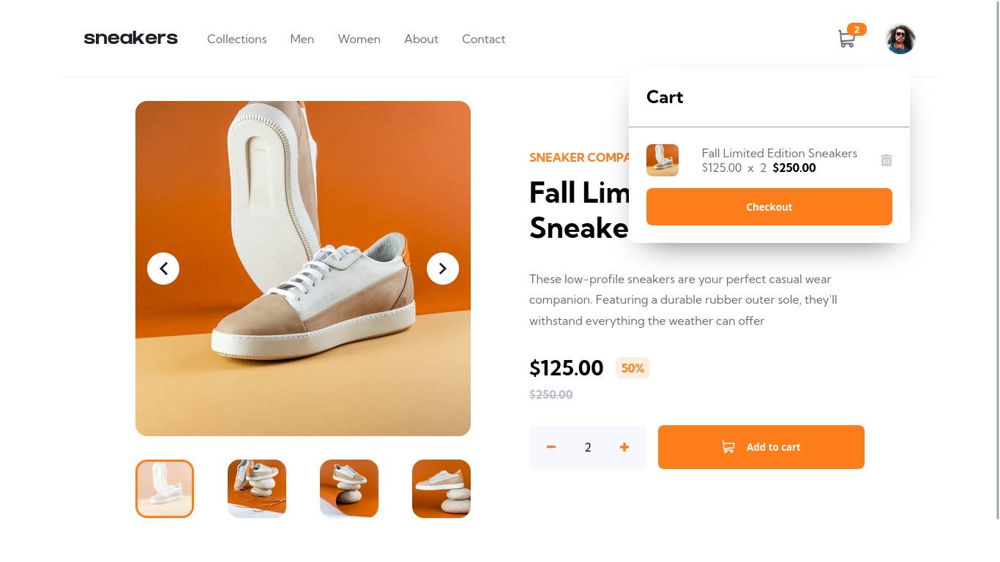

# Frontend Mentor - E-commerce product page solution

This is a solution to the [E-commerce product page challenge on Frontend Mentor](https://www.frontendmentor.io/challenges/ecommerce-product-page-UPsZ9MJp6). Frontend Mentor challenges help you improve your coding skills by building realistic projects.

## Overview

### Screenshot

### Links

- [Repository](https://github.com/zaarza/ecommerce-product-page)
- [Live preview](https://ecommerce-product-page-zaarza.vercel.app/)

## My process

### Features

- Fully responsive on any devices
- Adding item to cart
- Remove item from cart
- Lightbox image preview

### Framework / Library / Tools used

- NextJs
- Typescript
- SASS
- CSSMatic
- Font-size Clamp Generator by Walbo

### Useful Resources

- Google Fonts

## Author

- Website - [Arzaqul Mughny Al Fawwaz](https://www.zaarza.github.io)
- Frontend Mentor - [@zaarza](https://www.frontendmentor.io/profile/zaarza)
